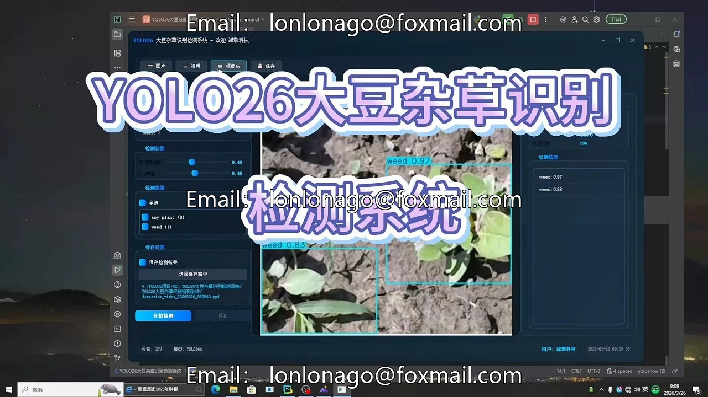
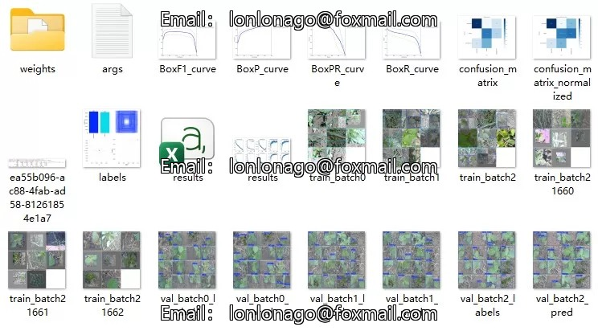
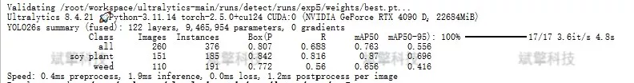
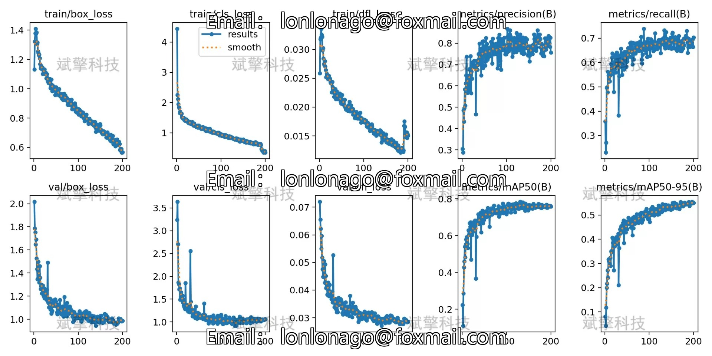
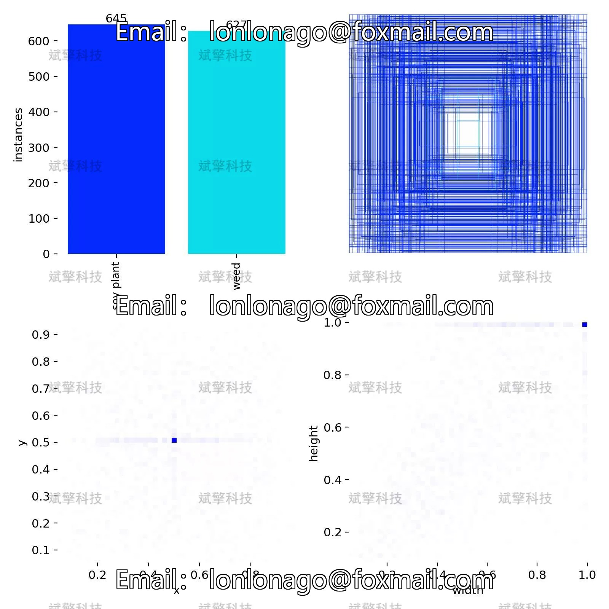
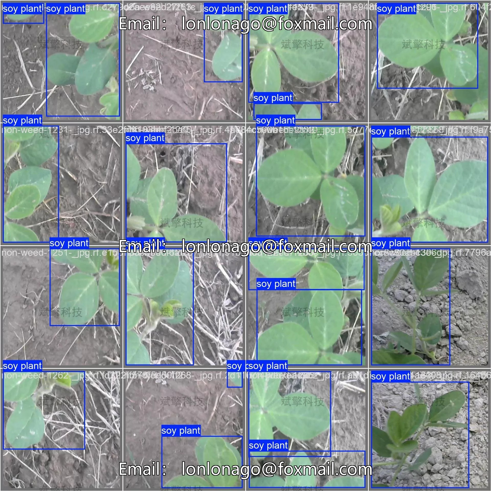
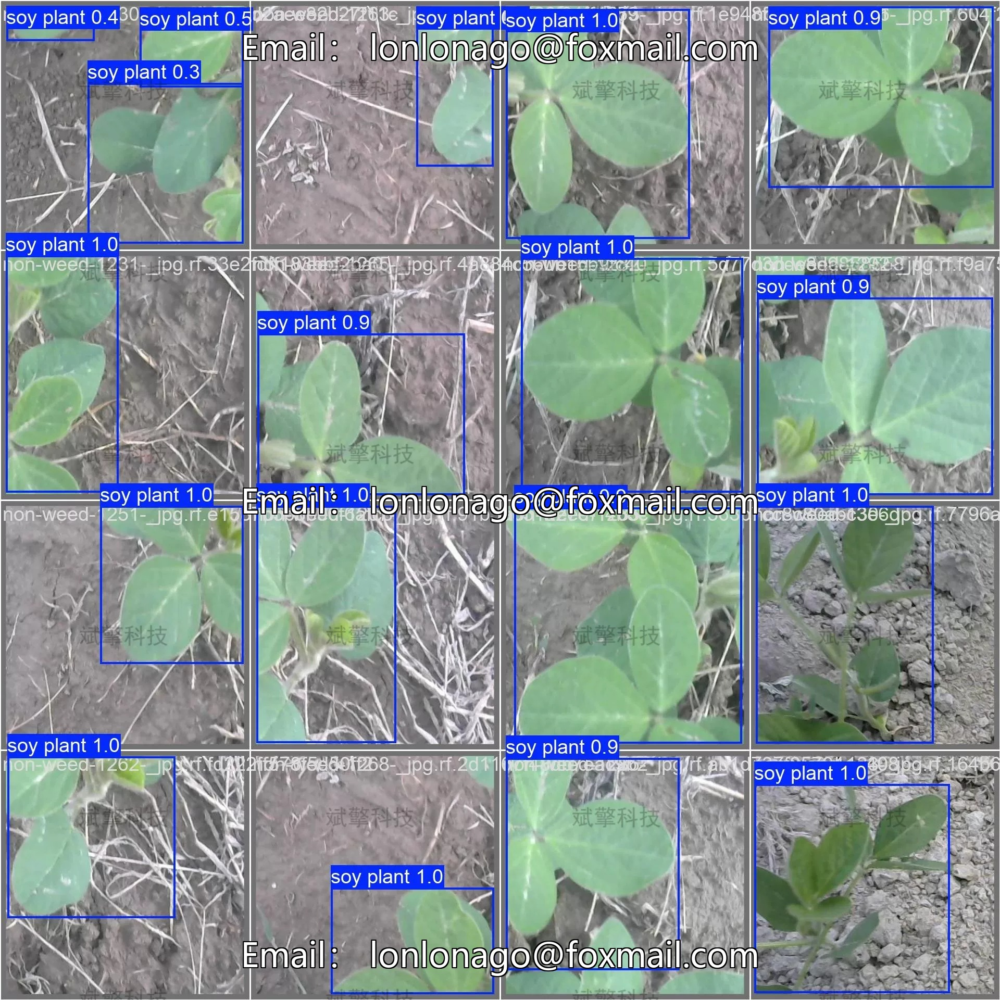
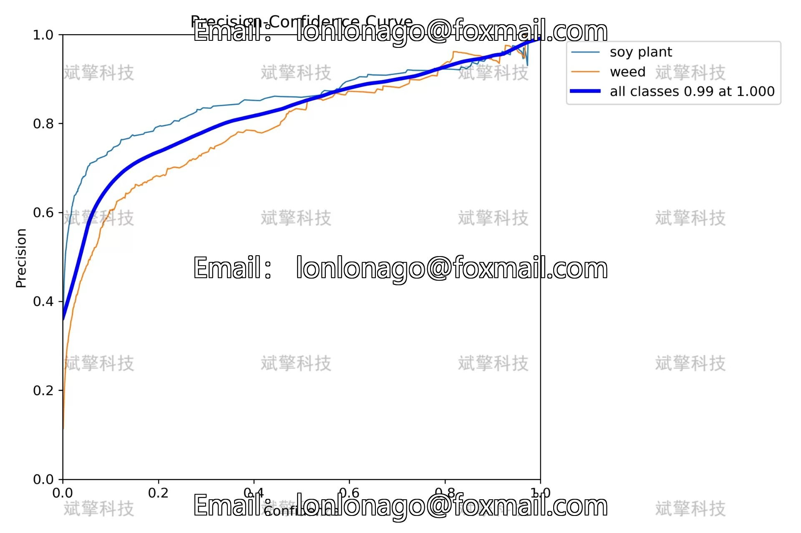

# YOLO26 Soybean Weed Detection System | Dataset

## Body

YOLO26 Soybean Weed Identification Detection System | Dataset Based on YOLO26 for Soybean Field Weed Identification System Performance Evaluation and Optimization Strategies (Project Source Code + Dataset + Model Weights + UI Interface + Python + Deep Learning + Remote Environment Deployment)

Precise identification of weeds from soybeans is a key technology for realizing intelligent farm management, which is significant for precise pesticide application, yield prediction, and sustainable agricultural development. This study constructs a soybean field weed identification detection system based on the YOLO26 object detection algorithm. The system includes two detection categories: soy plant (soy plant) and weed (weed). The dataset consists of a training set of 908 images, a validation set of 260 images, and a test set of 134 images, totaling 1302 images, including a large number of samples from different growth stages and lighting conditions in the field. The experimental results show that the model performs excellently in detecting soybeans with an mAP50 of 0.87, precision and recall rates of 0.842 and 0.816 respectively; however, it significantly underperforms in detecting weeds with an mAP50 of only 0.656, and recall rate drops to 0.56. Through confusion matrix analysis, more than 75% of the weeds were not correctly identified, mainly due to being misjudged as background or confused with soybeans. This study analyzes the reasons for the performance advantages and disadvantages of the model, proposes optimization strategies for weed detection, providing important experimental basis and improvement directions for the development of weed recognition systems in intelligent agriculture.

The dataset contains two detection categories, specifically defined as follows:
Soy Plant (soy plant): Cultivated soybean (Glycine max) plants, including all growth stages from seedling to maturity.
Weed (weed): All herbaceous plants in the soybean field except cultivated soybeans.
Training set: 908 images
Validation set: 260 images
Test set: 134 images

Free appointment for remote installation. Unsuccessful full refund.
Purchase now enjoy the following resources (auto-unlocked in Baidu Cloud):
YOLO Identification Detection Project Complete Source Code
YOLO format Dataset
Training code + UI interface code
Trained model + result images
Software installer
Add WeChat to make an appointment for remote installation (automatically displayed WeChat ID after purchase) - Unsuccessful, full refund guaranteed.

⚙️ Core Functional Modules
Detection Capability
Image Detection: Upon upload, returns detection boxes + category information
Video Detection: Supports video files, analyzing frames accurately
Camera Real-time Detection: Integrated with USB camera, achieving dynamic monitoring
Interaction and Control
Target Filtering: Choose one or multiple categories for detection
Parameter Real-time Adjustment: Adjustable confidence threshold & IoU threshold, flexible control accuracy
Result Save: One-click save of images/videos/camera detection results
System and Data
User Login and Registration: Support password strength check + encrypted storage
Log Recording: Auto-record operation and error information (timestamped)

## Images

## Payment

Here is a pay link on Stripe ( https://buy.stripe.com/3cs8yP7sY87d0vu9AB ). Please contact me lonlonago@foxmail.com after funding $89, and I will send you a complete data files , thank you!

